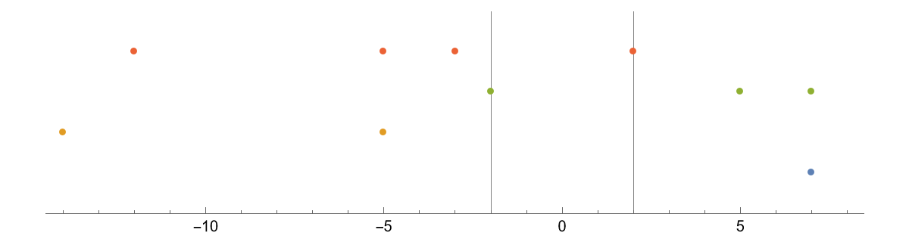
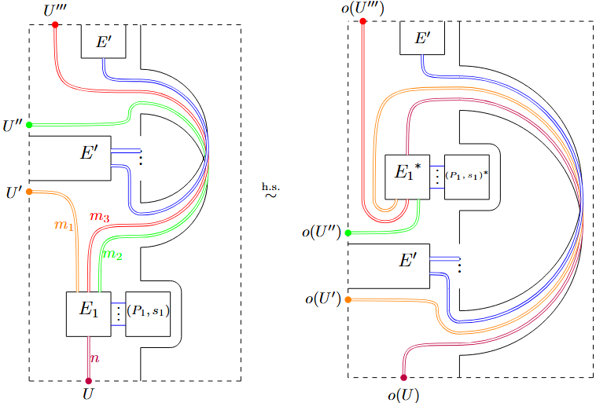

[Home](https://benjimorris.github.io/)  |  [Research & Selected Writings](https://benjimorris.github.io/research.html)  |  [Conferences/Workshops](https://benjimorris.github.io/talks.html)  |  [Teaching](https://benjimorris.github.io/teaching.html) | [CV](https://benjimorris.github.io/CV.html)

# Papers/Preprints
- ### Dec 2025: On semisimplicity criteria and non-semisimple representation theory for the Kadar-Yu algebras
Joint work with Paul Martin. Available on [arXiv](https://arxiv.org/abs/2512.24535). 

- ### June 2025: Temperley-Lieb Categories on Non-Orientable Surfaces
Joint work with Dionne Ibarra and Gabriel Montoya-Vega. Available on [arXiv](https://arxiv.org/abs/2506.14319). 

# Other Writings

- **January 2023** (Updated June 2023): A Terminating q-Lauricella Transformation Formula

[Here](/documents/q_series_id.pdf) we give a self contained discussion and proof of a charming q-series identity discovered in a previous project. For any integer n>0, it relates two terminating, type D, q-Lauricella series of rank n+1 and 2n-1, respectively. 
- **November 2021**: Towards a Factorised Solution of the Yang-Baxter Equation with Uq(sl_4) Symmetry

My Honours thesis, supervised by Professor Vladimir Mangazeev at the Australian National University. Available [here](/documents/thesis.pdf).
